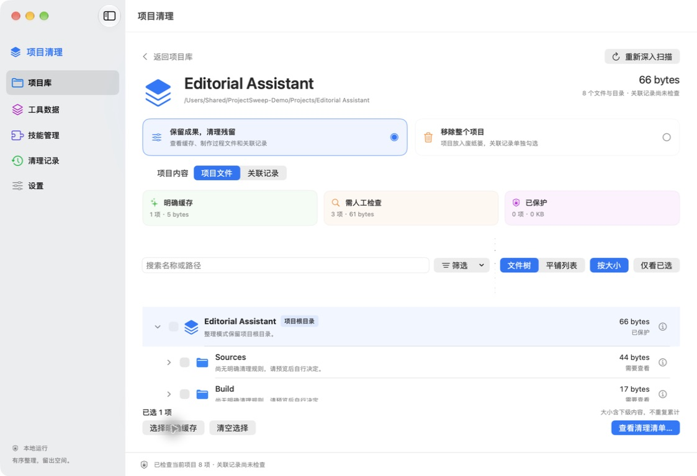
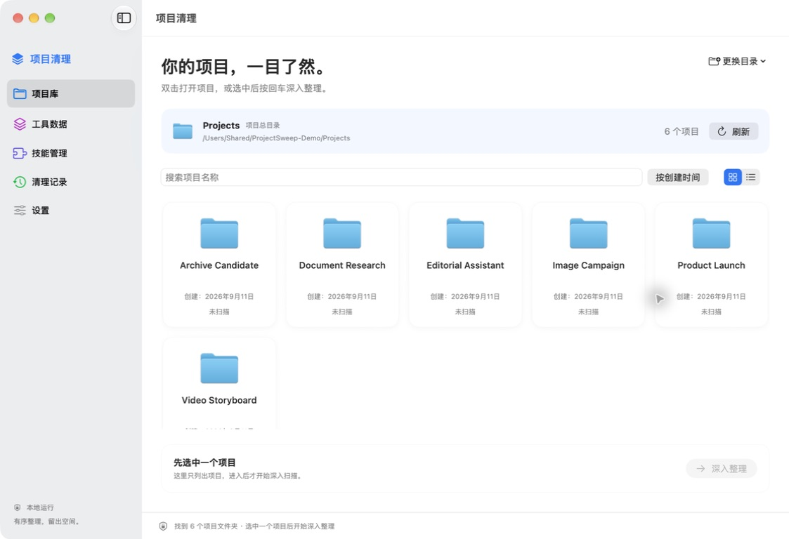

# Project Sweep

**English** | [简体中文](README.zh-CN.md)

[](https://github.com/Oliverzheng0727/project-sweep/actions/workflows/ci.yml)
[](https://github.com/Oliverzheng0727/project-sweep/releases/latest)
[](https://github.com/Oliverzheng0727/project-sweep/releases/latest)
[](LICENSE)

A native macOS app for safely cleaning up AI-assisted projects, local tool data, and skills. Inspect one project, choose exactly what to remove, review the impact, and clean up with explicit confirmation.

Project Sweep runs locally. It does not connect to an AI service, require an API key, or download a model. It supports code, documents, presentations, images, video, and mixed projects.

**Version:** 0.3.3 · **Platform:** Apple Silicon, macOS 14+ · **App interface:** Simplified Chinese

**[Download Project Sweep 0.3.3](https://github.com/Oliverzheng0727/project-sweep/releases/latest)** · [View the changelog](CHANGELOG.md)

<picture>
  <source media="(prefers-color-scheme: dark)" srcset="docs/images/project-cleanup-dark.jpg">
  
</picture>

_Screenshot uses generated demo data and a sanitized shared path._

## What you can do

- Browse a project library, then scan one project in depth.
- Keep finished work while removing selected leftovers, or move an entire project to Trash.
- Inspect local Codex, Claude Code, and Cursor data within the supported formats below.
- Manage Claude Code and Codex skills separately, including removing a shared skill's reference without deleting its original files.
- Preview files with Quick Look, reveal them in Finder, and mark content to always keep.
- Review cleanup results and restore files from Trash without overwriting existing files.

## Install

Download `ProjectSweep-macOS-arm64.zip` from the [latest release](https://github.com/Oliverzheng0727/project-sweep/releases/latest), extract it, and move **Project Sweep.app** to Applications.

Release builds use an ad hoc local signature and are not notarized. If macOS blocks the first launch, Control-click the app, choose **Open**, then confirm once. SHA-256 checksums and a source archive are attached to each release.

## Build and run

Requirements: an Apple Silicon Mac running macOS 14 or later and a Swift 6 toolchain from Xcode or the corresponding Command Line Tools. The app uses SwiftUI, AppKit, Foundation, CryptoKit, and system SQLite, with no third-party Swift packages.

```sh
git clone https://github.com/Oliverzheng0727/project-sweep.git
cd project-sweep
swift build
swift test
bash scripts/verify-ui-boundaries.sh
bash scripts/build-app.sh
```

The build script creates:

- `dist/Project Sweep.app` — the arm64 Release app.
- `dist/ProjectSweep-macOS-arm64.zip` — the packaged app, ready to extract into a local Applications folder.

Builds use a local ad hoc signature. They are not notarized or distributed through the Mac App Store. The script signs and packages the app in a separate temporary directory, avoiding Finder/iCloud attributes that a sync service may add to a workspace copy.

## Appearance

The default appearance follows macOS light and dark modes. Controls, selections, and project highlights use the system accent color, which you can change in System Settings → Appearance. Settings also lets you choose a fixed light or dark appearance.

Project cards use the native system folder image, adaptive surfaces, and subtle borders. Sidebar sections and scan categories have distinct semantic colors: green for clear caches and completed operations, orange for manual review and warnings, and purple for protected content. Labels and icons convey these meanings alongside color.

## Project cleanup

### Choose a project

Add or drag in a folder that contains your projects, such as a `Claude` folder on your Desktop. The library lists only its immediate project folders; it does not recursively scan every project to populate the home screen.



Grid and compact list views share search, sorting, and the current project selection. Dates come from each folder's **creation time**. Missing dates remain unknown rather than falling back to modification time or today's date. Double-click a project, or select it and press Return, to scan it in depth.

After a complete scan, its card can show the size, cache total, and scan time from the current app run. These values are separate from the folder's creation date. Projects without a completed scan are marked as unscanned.

### Choose a cleanup mode

| Mode | Behavior |
| --- | --- |
| Keep results, clean up leftovers | Keep the project root. Clearly identified caches have a selection shortcut. Build outputs, dependencies, intermediate drafts, and scripts require manual selection. |
| Remove the entire project | Move the selected project folder to Trash, including source files and finished work. Only the root has a cleanup checkbox; child entries are available for inspection and are included in the project removal. Existing scope and keep-rule checks still apply. |

Associated local sessions are selected separately on the project's related-records page, then reviewed alongside project files in a single confirmation list.

### Inspect the hierarchy

Project files default to a tree. The root has a distinct project icon and label, starts expanded, and contains initially collapsed child folders. Size sorting applies within each sibling group. The optional flat view separates the entire project from its contents, and the app remembers the chosen view.

The controls have separate roles:

- Arrows expand or collapse folders.
- File names open the detail pane.
- Checkboxes select cleanup items.

With a row focused, Left and Right collapse, expand, or navigate to a parent or child. Up and Down move between visible rows. Search, category filters, and selected-only mode retain the paths to matching files. Ancestors shown only for context have no cleanup checkbox and do not count as matches. Clearing filters restores the normal expansion state. Rescanning the same project retains existing expanded paths; switching projects expands only the new root.

The overview separates clear caches, items requiring manual review, and protected content. Clicking a category filters without selecting anything. A cache directory that can be handled as a unit counts once; ordinary parent folders do not double-count their contents. Document packages count as units, and incomplete statistics are identified explicitly.

Search, sorting, category changes, view changes, and project tab changes preserve cleanup selections. The footer shows selections outside the visible list. Switching projects, rescanning, changing cleanup modes, or revoking access clears outdated selections.

### Preview, protect, and review

The detail pane shows the path, size, classification reason, and protection information. Eligible local files support system Quick Look, an enlarged preview, Finder reveal, and an Always Keep action. Session details contain metadata and deletion impact rather than conversation content.

In cleanup mode, Git-tracked files, tool configuration, skills including `.agents/skills`, keep-marked content, and folders containing protected items are protected. Removing a user keep rule does not remove system protection.

Scans run in the background with progress, paths, elapsed time, and cancellation. Git protection is indexed per scan, with handling for nested repositories and document packages. Cleanup selection becomes available only after a complete scan; cancelled scans do not leave an executable partial plan.

The workflow is **scan → select → review → execute → inspect results**. Files moved to Trash can be restored to their original locations without overwriting a same-name file. Moving files to Trash still uses disk space: the app does not empty Trash or report moved bytes as freed disk space.

## AI tool support

Authorize each tool's data directory independently on the tool-data page or the project's related-records page. Custom locations are supported. Project associations use explicit paths or tool metadata; uncertain associations remain read-only or appear separately.

| Tool | Typical local directory | Current support |
| --- | --- | --- |
| Codex | `~/.codex` | Reads `threads` metadata and checks official `thread/delete` support at runtime. Parent and child sessions are handled as linked groups through the official interface. Deletion is disabled for unsupported interfaces or formats. |
| Claude Code | `~/.claude` | Handles explicitly associated UUID session JSONL files, version 1 session indexes, history indexes, and corresponding subagent/snapshot directories. Unselected sessions and project memory are preserved. Unattributed legacy agents, shared plans, and unknown formats remain read-only. |
| Cursor | `~/Library/Application Support/Cursor` | Can clean recognized caches and logs and list known Composer metadata read-only. **Session deletion is disabled.** Enabling it requires implementation and compatibility validation against an installed real version. |

A project library and a tool's history directory are separate locations with separate access grants. For example, `Desktop/Claude` might hold your projects, while `~/.claude` holds Claude Code's local records.

Connection status, scan completeness, and deletion capability are reported separately. A no-matching-sessions result requires completed session checks for all connected tools. Partial results, cancellation, failures, and unsupported formats are not reported as empty history.

Quit the relevant tool, including background processes, before cleaning its data. Project Sweep does not quit other apps for you. The Codex executable's full path can be configured in Settings.

**Session history is not backed up by default.** The review page requires separate acknowledgement that deletion may be irreversible. Claude cleanup uses temporary transaction data only to recover interrupted operations; successful completion removes it. An unfinished transaction blocks further session deletion and exposes a recovery action. Recovery does not overwrite conflicting files, and it is not a backup of successfully deleted sessions.

Authentication, global configuration, plugins, and skills are excluded from the tool-data cleanup adapters. Tool history support is local only; cloud history is outside the app's scope. Tool logos are bundled for offline display alongside names and accessibility labels; see [logo sources](docs/tool-logo-sources.md).

## Skills management

Open Skills Management and switch between **Claude Code** and **Codex**. The page automatically discovers local personal skills, shared directories, and plugin caches in the background. Search, descriptions, full paths, multi-selection, selected-only filtering, and a unified review list are available. Switching tools clears the previous selection.

Default discovery checks `~/.claude/skills`, `~/.codex/skills`, `~/.agents/skills`, and both tools' `plugins/cache` directories. Absolute `CLAUDE_CONFIG_DIR` or `CODEX_HOME` values in the app's environment add the corresponding skills and plugin-cache locations. Discovery checks these fixed locations without searching your entire home directory or all projects, and it does not create missing directories.

Refreshing or reopening the page discovers added or removed sources. Other locations can be added through the custom-directory control. Duplicate sources are merged, and unreadable sources report their paths instead of appearing as successful empty results.

| Source | Example | Behavior |
| --- | --- | --- |
| Personal skills | `~/.claude/skills`, `~/.codex/skills` | Move an explicitly selected skill folder, including its scripts and templates, to Trash. |
| Project skills | `project/.claude/skills` | Authorize the corresponding `skills` folder separately and manage it on the dedicated page. Normal project cleanup still protects skills. |
| Shared references | Symbolic links in a personal skills folder | **Remove only the current tool's link and preserve the target files.** The target is not read or followed, including for broken and relative links. |
| Shared originals | `~/.agents/skills`, `project/.agents/skills` | Read-only. Codex can read these directly, so there may be no separate reference to remove for that tool. Manage them in the original tool. |
| Plugin, system, and synced skills | `plugins` / `cache`, `.system`, `synced` | Read-only. Disable them in the original tool's plugin or sync settings; the app does not directly delete these caches or system skills. |

Ownership uses the tool, source, and explicit path; same-name skills are not merged. Shared-reference checks cover connected sources rather than every possible custom loading location or activation state. An original directory stays protected if another source uses it or the relationship check is incomplete. Before execution, the app rechecks sharing, directory identity, access scope, content changes, and file use.

Skill folders and references can be restored from cleanup records. Restoration preserves the original link text and never overwrites a same-name item. Records contain operation locations, not `SKILL.md` content. Skill removal does not change logins, sessions, global settings, or plugin configuration. A tool may need a new session or restart to stop using an already loaded skill. Existing cleanup records remain readable without migration.

This version does not edit Codex configuration to disable shared originals or uninstall entire plugins. References: [Claude Code Skills](https://code.claude.com/docs/en/skills), [Codex Skills](https://learn.chatgpt.com/docs/build-skills).

## Safety and local data

- Project scans stay within the selected root. Skills discovery additionally covers the fixed and custom sources described above.
- The scanner does not follow symbolic links, expose document-package internals as cleanup items, or intentionally read undownloaded cloud placeholders. Package metadata fingerprints help verify that a package has not changed before execution.
- Execution rechecks file identity, scope, modifications, Git tracking, and file use. Changed directory contents require a new scan.
- Always Keep also protects ancestor folders, preventing removal through a parent-folder selection.
- Cleanup records store paths, actions, status, size, time, and verification metadata, not conversation text. They are stored at `~/Library/Application Support/ProjectSweep/operations.json`.
- Folder bookmarks, keep rules, the Codex path, view preferences, and appearance are stored locally. Scan summaries live only in memory. There are no accounts, telemetry, automatic background cleanup, or external services.

## Development and validation

The core and UI checks are included in the build commands above. The current 0.3.3 acceptance record reports **92 passing core tests and 46 passing UI state checks**. Native interface checks used generated projects. See the [detailed acceptance record (Chinese)](docs/acceptance.md) for tested versions, methods, and limitations; a deployment target is not a claim of testing every supported OS or tool version.

The actual Codex protocol test is optional and skipped unless you provide a local CLI path:

```sh
PROJECT_SWEEP_TEST_CODEX=/absolute/path/to/codex swift test
```

It creates and deletes test sessions only in a temporary, isolated `CODEX_HOME`, without calling a model or touching normal tool directories.

An optional performance benchmark requires Python 3:

```sh
bash scripts/benchmark-scan.sh
```

It generates and scans a temporary project with 2,000 Git-tracked source files and 8,000 asset files, reports timing and a manifest summary, and removes its own fixture afterward. Set `SWEEP_SCAN_BUDGET_SECONDS=10` to apply a local time budget; no universal hardware threshold is imposed by default.

| Directory | Responsibility |
| --- | --- |
| `Sources/CleanupCore` | Scanning, rules, planning, execution, and operation records |
| `Sources/CleanupCore/Tools` | Independent tool adapters |
| `Sources/ProjectSweepApp` | Native interface and folder access |
| `Tests` | Isolated fixtures and regression checks |
| `scripts` | Build, verification, and benchmark commands |

Protocol and storage references: [Codex app-server protocol](https://github.com/openai/codex/blob/main/codex-rs/app-server/README.md), [Claude Code local directory](https://code.claude.com/docs/en/claude-directory), [Cursor history](https://docs.cursor.com/en/agent/chat/history). Formats can change; unknown structures remain read-only.

## Contributing and license

Issues and pull requests are welcome. Read [CONTRIBUTING.md](CONTRIBUTING.md) for development and reporting guidance. Use generated fixtures and remove personal paths, conversation content, and credentials from reports. See [SUPPORT.md](SUPPORT.md) for help and [SECURITY.md](SECURITY.md) for private vulnerability reporting.

Project source code is licensed under the [MIT License](LICENSE). Codex, Claude, and Cursor names and logos belong to their respective owners and are outside this project's MIT grant; see [third-party notices](THIRD_PARTY_NOTICES.md). Project Sweep is an independent project and does not imply official affiliation or endorsement.
