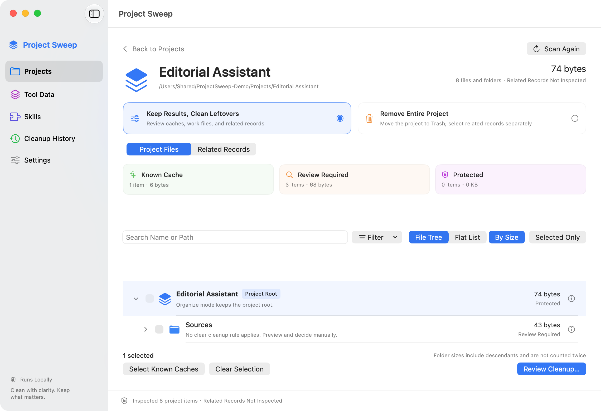
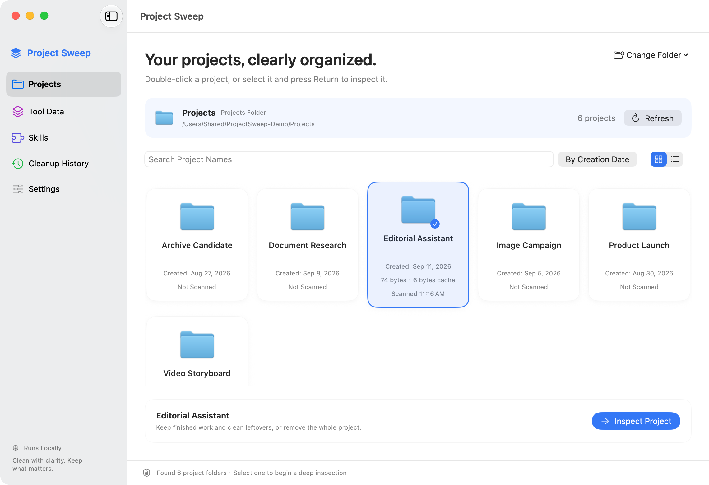

# 项目清理 · Project Sweep

[English](README.md) | **简体中文**

[](https://github.com/Oliverzheng0727/project-sweep/actions/workflows/ci.yml)
[](https://github.com/Oliverzheng0727/project-sweep/releases/latest)
[](https://github.com/Oliverzheng0727/project-sweep/releases/latest)
[](LICENSE)

原生中英文双语 Mac App，用于整理 AI 开发、文档、PPT、图片、视频项目留下的文件，以及受支持工具的本地数据。应用自身不接入 AI，不需要 API Key，不下载模型。

**[下载 Project Sweep 0.4.3](https://github.com/Oliverzheng0727/project-sweep/releases/latest)** · [查看更新记录](CHANGELOG.md)

<picture>
  <source media="(prefers-color-scheme: dark)" srcset="docs/images/project-cleanup-dark.png">
  
</picture>

_截图为无损 Retina PNG，使用生成的演示数据和不含个人信息的共享路径。_

## 下载与安装

从 [Releases](https://github.com/Oliverzheng0727/project-sweep/releases/latest) 下载 `ProjectSweep-macOS-arm64.zip`，解压后把 **Project Sweep.app** 移到“应用程序”。

当前公开构建使用本机临时签名，尚未经过 Apple 公证。如果首次双击被 macOS 拦截，请按住 Control 点击应用，选择“打开”，再确认一次。Release 同时提供 SHA-256 校验值与源码归档。

## 运行与使用

当前版本 **0.4.3**，面向 Apple Silicon、macOS 14 及以上，使用本机临时签名；尚未公证或用于商店发布。从源码构建后，可将 `dist/ProjectSweep-macOS-arm64.zip` 解压到本机应用程序目录运行。

构建同时生成 `dist/Project Sweep.app`。如果工作区在 iCloud 等同步目录中，同步服务可能为应用补写 Finder 属性并干扰签名校验；ZIP 在独立临时目录完成签名与归档，不受这类属性回写影响。

1. 在「项目库」选择或拖入项目总目录，例如桌面的 `Claude` 文件夹。首页只列出第一层项目文件夹，不深入扫描所有项目。
2. 网格或紧凑列表共用搜索、排序、筛选、置顶和选中项目。可筛选最近打开、已扫描、包含缓存或不可用的项目，且不会为此扫描整个项目库。日期以文件夹本身的**创建时间**为准，「按创建时间」从新到旧排序；无法读取时显示「未知」，不拿修改时间或当前时间代替。双击项目，或选中后按回车「深入整理」。随后只扫描这个项目的文件，并匹配已授权工具中明确关联的本地记录。已完成扫描的项目额外显示本次运行中上次扫描的大小、缓存量和时间，创建日期仍然保留；其他项目显示「未扫描」。


3. 「保留成果，清理残留」保留根目录，明确缓存可用快捷按钮选中。构建产物、依赖、中间稿和脚本需要手动选择。默认使用文件树，项目根目录采用独立图标和“项目根目录”标签，首次展开根目录、内部目录收起；大小排序仅比较同级内容。也可切换平铺列表，根目录和内部文件分别显示，展示方式会保存。
4. 点击文件行查看右侧详情，勾选框单独控制清理选择。详情提供系统 Quick Look、放大预览、Finder 定位和「始终保留」。Git 已跟踪文件、工具配置与技能（包括 `.agents/skills`）、保留项和包含这些内容的上层目录受到保护；取消个人保留不会解除系统保护。
5. 「移除整个项目」仅在项目根目录显示清理勾选框，以整个所选文件夹为单位移入废纸篓，包括源码和作品。内部条目用于查看，并提示会随项目一起移入废纸篓。在同一项目的「关联记录」页另外勾选相关会话，然后与项目文件一起查看最终清单。
6. 检查最终清单后执行，在「清理记录」查看每项结果。文件可恢复到原位置，遇到同名文件不会覆盖。

历史会话默认不备份，确认页需要单独确认可能无法恢复。移入废纸篓仍占用磁盘，应用不自动清空废纸篓，也不把移动量宣称为已释放空间。

项目概览分为「明确缓存、需人工检查、已保护」，点击只筛选、不自动勾选。可整组处理的缓存目录按一个单位统计，普通父目录不重复累计，文档包按整体统计；无法完整校验的内容单独提示。搜索、分类、排序、文件树和项目内标签切换保留勾选，底栏显示当前列表外的已选数量，并可切换「仅看已选」。切换项目、重新扫描、更换模式和撤销授权会清除过期选择。

文件树中，箭头只控制展开和收起，点击名称打开详情，勾选框单独控制清理。选中文件行后，可用左右方向键展开、收起或进入子级、返回上级，上下键浏览相邻可见行。搜索、分类和“仅看已选”保留匹配项的上级路径，辅助定位的祖先标为“所在目录”，不加入匹配数量或清理选择；清除筛选恢复原来的展开状态。同一项目重新扫描保留仍存在的展开路径，切换项目仅展开新根目录。

深入扫描时显示当前步骤、已检查数量、路径和耗时。Git 保护规则在每次扫描中建立索引，遇到嵌套仓库和文档包时补充，避免逐文件遍历整份跟踪清单。完整扫描后才能勾选清理；取消不会留下可执行的部分结果。

## 语言与外观

界面默认跟随 macOS 语言。在「设置 → 语言」中可选择 **English**、**简体中文**或**跟随系统语言**，切换立即生效，不改变文件名、项目名和工具名。

默认跟随 macOS 的浅色和深色外观。按钮、选中状态和项目高亮使用系统强调色，可在“系统设置 → 外观”中更改；应用设置仍可单独选择固定浅色或深色。

项目卡片使用系统文件夹图标、适配明暗的背景和细边框。侧栏和扫描分类通过语义颜色区分：明确缓存和成功操作使用绿色，人工检查和警告使用橙色，受保护内容使用紫色；文字与图标同时说明含义，不仅依赖颜色。

## 工具支持范围

打开「工具数据」或项目的「关联记录」页时，应用会自动检索并扫描 Codex、Claude Code 和 Cursor 已存在的标准数据目录。只检查下表三个固定位置，不遍历整个用户目录或其他项目，也不接受符号链接根目录。每个 AI 仍可单独选择自定义位置；手动断开后会保持断开，直到用户再次手动连接。项目归属来自本地记录中的明确路径，无法确认时保持只读或单独列出。

工具卡片及关联记录分组显示 Codex、Claude、Cursor 的标识，图片随应用打包，离线可显示；文字名称和辅助功能标签继续保留。资源来源见 [工具标识来源](docs/tool-logo-sources.zh-CN.md)。

| 工具 | 本机目录示例 | 首版支持情况 |
| --- | --- | --- |
| Codex | `~/.codex` | 只读检查 `threads` 元数据，运行时验证官方 `thread/delete` 能力。父会话与子会话作为关联组处理，删除通过官方接口。接口或数据格式不受支持时禁用。 |
| Claude Code | `~/.claude` | 支持可明确关联的 UUID 会话 JSONL、版本 1 会话索引、历史索引及对应子代理/快照等目录。保留未选会话和项目记忆。旧版无法归属的代理、共享计划或未知格式保持只读。 |
| Cursor | `~/Library/Application Support/Cursor` | 明确缓存和日志可清理；已知 Composer 元数据可只读列出。**会话删除始终禁用**，须安装实际版本并完成兼容性验收后开发启用。 |

Project Sweep 0.4.3 已使用本机安装的 **Codex CLI 0.147.0** 完成实际协议验收：在独立临时 `CODEX_HOME` 中启动官方 app-server，创建两个测试线程，通过 `thread/delete` 删除其中一个，确认另一个仍可读取且被删线程无法再读取。测试没有调用模型，也没有访问或删除用户正常会话。

项目总目录和工具记录目录是独立的授权入口；例如桌面的 `Claude` 用来放项目，`~/.claude` 用来保存 Claude Code 本地记录。

每个工具分别显示连接和检查状态；会话能否完整读取与能否删除单独表示。只有已连接工具全部完成会话检查时才会显示「未找到关联会话」。部分结果、取消、失败和未支持格式都不会被当成没有历史记录。

目录检索在后台执行，可取消；未安装、手动断开、无法访问及授权失效分别说明。进入「关联记录」保留项目文件及其勾选，扫描过程中切换标签也会在文件扫描完成后继续检索。每个工具完成后立即显示其结果；「重新检索并扫描」会重试已连接工具，保留项目文件与文件选择，只清除需要更新的会话选择。

Codex 中个别不完整记录不会再导致所有会话消失：可读取的元数据继续展示，缺少项目路径的会话单独归组。文件缺失或关联不完整时，删除继续禁用。应用生成的默认会话标题随界面语言切换，用户自定义标题保持原样。

执行工具数据清理前须完全退出对应工具，包括后台进程。清理程序不会替你关闭其他应用。Codex 可在「设置」指定命令行程序的完整路径。

Claude 会话使用临时事务保存中断恢复所需的数据，成功后清除。若存在未完成事务，扫描会停止会话删除并提供「恢复未完成事务」入口；原位置发生冲突时不会覆盖。该机制不提供已成功删除会话的备份。

认证信息、全局配置、插件、技能不在工具适配器的清理清单中。支持范围仅为本机；不会清理任何云端历史。

## 技能管理（Skills）

在侧栏打开「技能管理」，分别切换 **Claude Code** 和 **Codex**。进入页面即在后台自动检索本机的个人技能、共享目录和插件缓存，无需逐个选择默认目录；支持搜索、查看简介和完整路径、多选、仅看已选，以及统一确认清单。切换 AI 会清除之前的选择，避免把另一工具的技能带入清理。

默认检索 `~/.claude/skills`、`~/.codex/skills`、`~/.agents/skills` 和两个工具的 `plugins/cache`。若应用运行环境指定了绝对路径的 `CLAUDE_CONFIG_DIR` 或 `CODEX_HOME`，也检查其技能与插件缓存位置。只检查这些固定位置，不搜索整个用户目录或所有项目；不存在的目录不会创建。刷新与重新进入页面会重新发现目录，自定义来源通过“技能来源 → 添加自定义目录”补充；同一来源不重复显示。无权限读取会提示具体位置，不计为成功的空结果。

| 来源 | 目录示例 | 处理方式 |
| --- | --- | --- |
| 个人技能 | `~/.claude/skills`、`~/.codex/skills` | 明确选择后，将单个技能文件夹及其脚本、模板移入废纸篓 |
| 项目技能 | `项目/.claude/skills` 等 | 单独授权对应 `skills` 目录，在专用页面选择；不改变项目整理的技能保护 |
| 共享引用 | 个人 `skills` 目录中的符号链接 | **只移除当前 AI 的链接，保留目标原文件**；不读取或跟随目标，包括失效链接和相对链接 |
| 共享原目录 | `~/.agents/skills`、项目 `.agents/skills` | 保持只读；Codex 直接读取这里，无法通过删除独立链接对其停用。请在原工具中管理 |
| 插件、系统、同步技能 | `plugins` / `cache`、`.system`、`synced` | 只读展示，在原工具的插件或同步管理中停用；不直接删除插件缓存或系统技能 |

技能归属按默认位置、自定义来源和明确路径区分，同名技能不会合并。共享关系只检查已连接目录，不代表确认了所有自定义加载位置或启用状态。发现另一来源使用原目录时禁止删除原文件；来源检查不完整时，原文件保持只读。执行前重新验证共享关系、授权目录身份、内容修改和占用状态。

从「清理记录」可恢复技能文件夹及引用。恢复不覆盖同名项目，引用恢复保留原始链接文本；记录只保存操作定位信息，不保存 `SKILL.md` 正文。技能移除不改登录、会话、全局设置或插件配置；已经加载的技能可能要新建会话或重启工具才会消失。旧版记录继续可读，无需迁移。

目录与管理行为参考：[Claude Code Skills](https://code.claude.com/docs/en/skills)、[Codex Skills](https://learn.chatgpt.com/docs/build-skills)。本版不自动修改 Codex 配置来停用共享原文件，也不实现整插件卸载。

## 安全边界与数据保存

- 项目扫描限于用户选择的根目录；技能扫描另外覆盖上述默认位置和手动添加的自定义目录。不跟随符号链接，不展示文档包内部清理项，不主动读取未下载的云端占位内容。文档包的元数据指纹用于执行前确认整体未变化。
- 扫描可取消。执行前复核文件身份、所在范围、修改状态、Git 跟踪和占用情况；目录内容改变后要求重新扫描。
- 「始终保留」规则也保护上层目录，防止通过整目录选择绕过保护。
- 清理记录只保存路径、动作、状态、大小、时间和校验定位信息，不保存聊天正文。位置为 `~/Library/Application Support/ProjectSweep/operations.json`。
- 文件夹书签、手动断开的默认工具、保留规则、Codex 路径、网格/列表和主题偏好保存在本地设置中；扫描摘要只留在内存。没有账号、遥测、后台自动清理或外部服务。本次更新不迁移清理记录存储格式。

## 源码与构建

依赖系统 Swift 6 工具链（Xcode 或相应 Command Line Tools）、AppKit、SwiftUI、CryptoKit 和系统 SQLite，无第三方包。

```sh
git clone https://github.com/Oliverzheng0727/project-sweep.git
cd project-sweep
swift build
swift test
python3 scripts/verify-localizations.py
bash scripts/verify-ui-boundaries.sh
bash scripts/build-app.sh
```

`build-app.sh` 生成 arm64 Release 可执行文件、图标、Info.plist，并完成本地签名校验。产物位于 `dist/Project Sweep.app`，同时生成不携带 Finder/iCloud 扩展属性的 `dist/ProjectSweep-macOS-arm64.zip`。

构建、界面检查和性能脚本把编译产物按工作区分别保存到 `~/Library/Caches/ProjectSweep/Builds`，可用 `SWEEP_BUILD_PATH` 覆盖，兼容 Swift 6.4 新构建引擎和旧 SwiftPM 布局。在同步目录直接运行 `swift test` 时，可增加 `--scratch-path /tmp/project-sweep-tests`，避免同步服务为测试包附加属性而导致签名失败。

本版通过 **112 项核心测试（含实际 Codex CLI 协议验收）、55 项界面状态检查和 597 个英文词条检查**。所有删除与恢复测试使用隔离生成数据。

可选性能基准（另需 Python 3）：`bash scripts/benchmark-scan.sh`。脚本只生成并扫描临时项目，包含 2,000 个 Git 已跟踪源码文件及 8,000 个素材文件，结束后删除自己生成的测试目录，输出扫描耗时和清单摘要。可通过 `SWEEP_SCAN_BUDGET_SECONDS=10` 设置本机验收预算；默认不设通用硬件耗时门槛。

若需运行真实 Codex 协议验收，显式设置本机 CLI 路径；测试只在独立的临时 `CODEX_HOME` 创建和删除测试会话，不调用模型、不操作正常工具目录：

```sh
PROJECT_SWEEP_TEST_CODEX=/absolute/path/to/codex swift test
```

目录结构：`Sources/CleanupCore` 为扫描、规则、计划、执行及记录；`Sources/CleanupCore/Tools` 为独立工具适配器；`Sources/ProjectSweepApp` 为界面和文件夹授权；`Tests` 为隔离验收数据和回归检查。完整验收记录见 `docs/acceptance.md`。

协议与存储参考：[Codex 官方协议](https://github.com/openai/codex/blob/main/codex-rs/app-server/README.md)、[Claude Code 本地目录](https://code.claude.com/docs/en/claude-directory)、[Cursor 历史记录](https://docs.cursor.com/en/agent/chat/history)。这些格式可能更新，未知结构按只读处理。

## 参与和许可

欢迎通过 [Issues](https://github.com/Oliverzheng0727/project-sweep/issues) 反馈问题或提交 Pull Request。测试与提交说明见 [CONTRIBUTING.md](CONTRIBUTING.zh-CN.md)。反馈时请使用生成的测试项目，并移除个人路径、会话正文及凭据。一般帮助见 [SUPPORT.md](SUPPORT.md)，安全或隐私问题请按 [SECURITY.md](SECURITY.md) 私密报告。

本项目源码采用 [MIT License](LICENSE)。Codex、Claude 和 Cursor 的名称与标识属于各自权利人，不属于本项目 MIT 授权范围；来源与说明见 [第三方资源说明](THIRD_PARTY_NOTICES.zh-CN.md)。Project Sweep 是独立项目，不代表这些工具的官方产品或合作关系。
